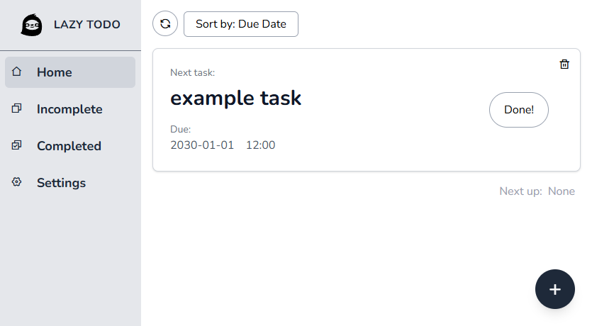

#### 日本語の説明は下にあります。

# LAZY TODO

A simple task manager focused on showing what to do next.

## Screenshot



## Features

- Add tasks with due date and time
- Show the only next task on the home page
- View incomplete and completed tasks separately
- Edit and delete tasks
- Save tasks and settings in localStorage
- Sort tasks by created order or due date
- Send tasks to Google Tasks

## Tech Stack

- React
- React Router
- Vite
- Tailwind CSS
- Go

## External API

- Google Tasks API

## Google Tasks Integration

Google Tasks integration is implemented, but public OAuth access is currently limited while Google OAuth verification is in progress.

For now, only Google accounts registered as test users in the Google Cloud project can complete the OAuth flow.

## For Developers

Run the app locally:

```bash
cd ./frontend
npm install
npm run dev
```

To test Google Tasks integration locally, set the Google OAuth environment variables and start the backend server.

```bash
cd ./backend
go run main.go
```
The following variables are required in ./backend/.env:
```env
PORT=8080
GOOGLE_CLIENT_ID=...
GOOGLE_CLIENT_SECRET=...
GOOGLE_REDIRECT_URL=http://localhost:8080/auth/google/callback
FRONTEND_URL=http://localhost:5173
```
# 

# LAZY TODO

次に何をすればよいのかにフォーカスしたシンプルなタスク管理アプリです

## スクリーンショット


## 特徴

- 日時を指定してタスクを追加できます
- ホームでは次にやるタスクのみが表示されます
- 未完了タスクと完了タスクを確認できます
- タスクの編集と削除ができます
- タスクと設定はローカルストレージ上に保存されます
- 作成日順と期限順でタスクの順番をソート変更できます
- でGoogle Tasksにタスクを追加できます

## 技術スタック

- React
- React Router
- Vite
- Tailwind CSS
- Go

## 外部API

- Google Tasks API

## Google Tasksについて

Google Tasksとの連携は実装済みですが、現在はGoogle OAuthの検証中です。

そのため、現時点ではGoogle Cloudプロジェクトにテストユーザーとして登録されたGoogleアカウントのみが利用できます。

## デベロッパ向け

ローカルで動かすには:

```bash
cd ./frontend
npm install
npm run dev
```

Google Tasksをローカルで試す場合は、Google OAuth用の環境変数を設定したうえでバックエンドを起動します。

```bash
cd ./backend
go run main.go
```
./backend/.envに以下の変数が必要です。
```env
PORT=8080
GOOGLE_CLIENT_ID=...
GOOGLE_CLIENT_SECRET=...
GOOGLE_REDIRECT_URL=http://localhost:8080/auth/google/callback
FRONTEND_URL=http://localhost:5173
```