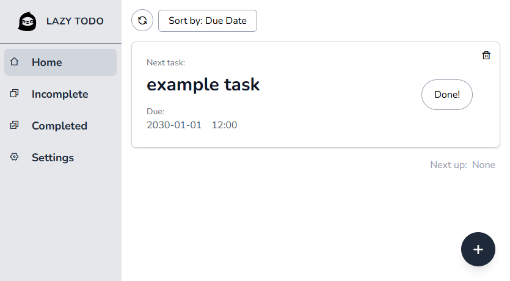

#### 日本語の説明は下にあります。

# LAZY TODO

A simple task manager focused on showing what to do next.

## Screenshot



## Features

- Add tasks with due date and time
- Show only the next task on the home page
- View incomplete and completed tasks separately
- Edit and delete tasks
- Save tasks and settings in localStorage
- Sort tasks by created date or due date
- Add tasks to Google Tasks

## Tech Stack

Application:

- React
- React Router
- Vite
- Tailwind CSS
- Go
- Google Tasks API

Infrastructure and tooling:

- Docker
- Docker Compose
- nginx
- ESLint
- Prettier

## Project Structure

```text
lazy-todo/
├─ frontend/        # React/Vite frontend
├─ backend/         # Go backend API
├─ compose.yaml     # Docker Compose config
└─ package.json     # Workspace scripts
```

## Google Tasks Integration

Google Tasks integration is implemented, but public OAuth access is currently limited while Google OAuth verification is in progress.

For now, only Google accounts registered as test users in the Google Cloud project can complete the OAuth flow.

## Run With Docker

Docker Compose starts both the frontend and backend containers.

```bash
cp ./backend/.env.example ./backend/.env
docker compose up --build
```

Open the frontend in your browser:

```text
http://localhost:5173
```

The backend listens on:

```text
http://localhost:8080
```

Stop the containers:

```bash
docker compose down
```

## Environment Variables

To use Google Tasks integration, set the OAuth values in `backend/.env`.

```env
PORT=8080
GOOGLE_CLIENT_ID=...
GOOGLE_CLIENT_SECRET=...
GOOGLE_REDIRECT_URL=http://localhost:8080/auth/google/callback
FRONTEND_URL=http://localhost:5173
```

The frontend API endpoint is configured with `VITE_API_BASE_URL` in `frontend/.env` or as a Docker build argument.

```env
VITE_API_BASE_URL=http://localhost:8080
```

When running with Docker locally, `http://localhost:8080` is correct because the frontend code runs in the user's browser and must call the backend through a browser-accessible URL.

## Run Locally Without Docker

frontend:

```bash
cd ./frontend
npm install
npm run dev
```

backend:

```bash
cd ./backend
go run main.go
```

## Development Commands

Run these from the repository root.

```bash
npm run lint
npm run format
npm run format:check
npm run docker:up
npm run docker:down
```

If PowerShell blocks `npm`, use `npm.cmd`.

```bash
npm.cmd run lint
```

#

# LAZY TODO

次に何をすればよいのかにフォーカスした、シンプルなタスク管理アプリです。

## スクリーンショット


## 特徴

- 日時を指定してタスクを追加できます
- ホーム画面では次にやるタスクだけを表示します
- 未完了タスクと完了タスクを分けて確認できます
- タスクの編集と削除ができます
- タスクと設定を localStorage に保存します
- 作成日順と期限順でタスクをソートできます
- Google Tasks にタスクを追加できます

## 技術スタック

アプリケーション:

- React
- React Router
- Vite
- Tailwind CSS
- Go
- Google Tasks API

インフラ・開発ツール:

- Docker
- Docker Compose
- nginx
- ESLint
- Prettier

## プロジェクト構成

```text
lazy-todo/
├─ frontend/        # React/Vite frontend
├─ backend/         # Go backend API
├─ compose.yaml     # Docker Compose config
└─ package.json     # Workspace scripts
```

## Google Tasks 連携

Google Tasks 連携は実装済みですが、現在は Google OAuth の検証中です。

そのため、現時点では Google Cloud プロジェクトにテストユーザーとして登録された Google アカウントのみが利用できます。

## Docker で起動する

Docker Compose で frontend と backend のコンテナをまとめて起動できます。

```bash
cp ./backend/.env.example ./backend/.env
docker compose up --build
```

起動後、ブラウザで以下にアクセスします。

```text
http://localhost:5173
```

backend は以下で待ち受けます。

```text
http://localhost:8080
```

停止する場合:

```bash
docker compose down
```

## 環境変数

Google Tasks 連携を使う場合は、`backend/.env` に OAuth 用の値を設定します。

```env
PORT=8080
GOOGLE_CLIENT_ID=...
GOOGLE_CLIENT_SECRET=...
GOOGLE_REDIRECT_URL=http://localhost:8080/auth/google/callback
FRONTEND_URL=http://localhost:5173
```

frontend の API 接続先は `frontend/.env` または Docker build arg の `VITE_API_BASE_URL` で指定します。

```env
VITE_API_BASE_URL=http://localhost:8080
```

Docker でローカル起動する場合は、フロントエンドの JavaScript がユーザーのブラウザ上で実行されるため、ブラウザから見える backend の URL である `http://localhost:8080` を指定します。

## Docker なしでローカル起動する

frontend:

```bash
cd ./frontend
npm install
npm run dev
```

backend:

```bash
cd ./backend
go run main.go
```

## 開発用コマンド

ルートディレクトリから実行できます。

```bash
npm run lint
npm run format
npm run format:check
npm run docker:up
npm run docker:down
```

PowerShell で `npm` が実行ポリシーにより止まる場合は、`npm.cmd` を使ってください。

```bash
npm.cmd run lint
```
